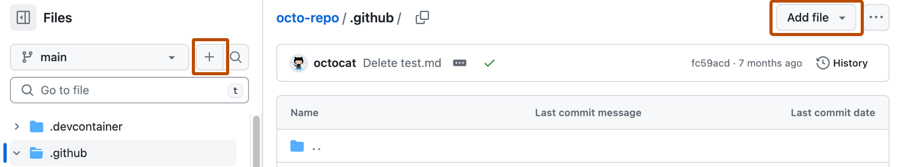
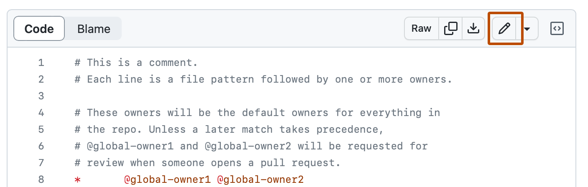
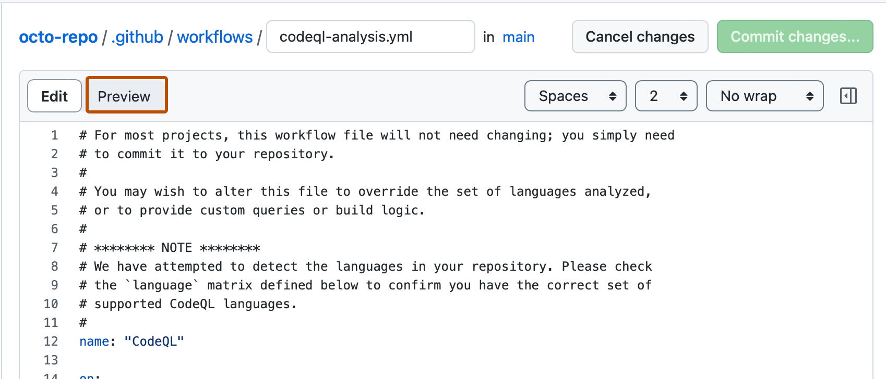
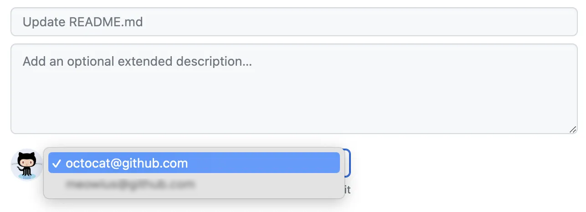
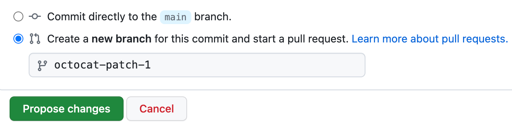

# How to edit the SBG NorCal × MATS website

**A guide for non-technical contributors** — coaches, front-desk staff,
board members. **No Git, no terminal, no installation required.** Everything
happens in your web browser, on github.com.

---

## What you can do from this guide

Each "recipe" is a step-by-step for one common task. Skip to the one you need.

| If you want to… | Jump to |
|---|---|
| Add a new coach | [Add a coach](#recipe-add-a-coach) |
| Update an existing coach's bio | [Edit a coach](#recipe-edit-a-coach) |
| Remove a coach who left | [Delete a coach](#recipe-delete-a-coach) |
| Add a new upcoming event | [Add an event](#recipe-add-an-event) |
| Move an event to "past" or change details | [Edit an event](#recipe-edit-an-event) |
| Cancel/remove an event | [Delete an event](#recipe-delete-an-event) |
| Change a class on the weekly schedule | [Edit the schedule](#recipe-edit-the-schedule) |
| Change gym phone, hours, address, social links | [Update site info](#recipe-update-site-info) |
| Update the navigation menu | [Edit the menu](#recipe-edit-the-menu) |
| **Resize a photo to the right size** | [Image specifications](#image-specifications) |

If you've never used GitHub before, also read
[The 30-second mental model](#the-30-second-mental-model) and
[The GitHub web workflow](#the-github-web-workflow) below.

---

## The 30-second mental model

The website lives in a "repository" (a folder of files) on GitHub. Every
piece of content — coaches, events, programs, gym hours — is a small text
file. To change the site, you change one of those files.

You **never edit the live site directly**. Instead:

1. You **propose** a change (called a "pull request" or "PR").
2. Someone (usually the gym lead) **approves and merges** your PR.
3. The site **rebuilds automatically** and your change is live within a
   minute or two.

Think of it like Google Docs with "Suggest mode" turned on, except for a
whole website.

---

## The GitHub web workflow

These are the steps you'll repeat for **every** change. Each recipe below
just changes which file you're editing. Once you've done it twice, it
takes 60 seconds.

### Step 1 — Sign in to github.com

You need a (free) GitHub account, and the gym lead needs to add you as a
collaborator on the repository. Ask them once; you're set forever after.

### Step 2 — Open the repository

Go to <https://github.com/SBG-NorCal/sbg-norcal.github.io>
(your bookmark this; the gym lead will share the real URL once the repo
is created).

### Step 3a — Adding a NEW file

Browse to the folder you need (the recipes below tell you which folder).
Click the **Add file** button (top right) → **+ Create new file**.



GitHub will ask you to name the file. Use the exact name pattern the
recipe gives you (e.g. `firstname-lastname.md`).

### Step 3b — Editing an EXISTING file

Click the file name in the list. On the file's page, click the **pencil
icon** at the top right.



### Step 4 — Type or paste the content

Each recipe gives you a template you can copy/paste. Fill in the blanks.

You can click **Preview** at the top of the editor to see if your
formatting looks right before saving.



### Step 5 — Save by clicking "Commit changes…"

The green button in the top right says **Commit changes…**. Click it.

A dialog opens. Fill in a short description of what you did:



> **Tip:** A good commit message is one sentence in plain English.
> *"Add Jane Doe as new BJJ coach"* or *"Cancel the March wellness
> workshop"* is perfect.

### Step 6 — Choose "Create a new branch" and Propose

Below the commit message you'll see two radio buttons. Pick the second one,
**"Create a new branch for this commit and start a pull request."** GitHub
auto-fills the branch name; leave it alone.



Click the green **Propose changes** button.

### Step 7 — Open the pull request

GitHub takes you to a "Comparing changes" page. Click the green
**Create pull request** button (top right). On the next page, click
**Create pull request** once more to confirm.


🎉 **That's it.** Your change is now a pull request. The gym lead will get
an email, review the change, and click "Merge" — at which point the live
site rebuilds in about 60 seconds.

### Step 8 — (Optional) Check on your PR later

Go to the **Pull requests** tab at the top of the repository. Your PR
shows up there until it's merged or closed. You can reply to review
comments, push more edits, or close it if you change your mind.

---

# Recipes

## Recipe: Add a coach

**Folder:** [`_coaches/`](../_coaches/)

**File name:** `firstname-lastname.md` (all lowercase, hyphens for spaces).
Example: `jane-doe.md`.

**File contents** — copy/paste this template, replace the values:

```yaml
---
name: Jane Doe
slug: jane-doe                  # must match file name (without .md)
order: 13                       # 1-12 already taken; pick the next number
role: Foundations Jiu-Jitsu Coach
program: Brazilian Jiu-Jitsu
photo: /assets/images/coaches/jane-doe.jpg
belt: BJJ Purple Belt
secondary_belt: ""              # optional, leave empty if none
years_training: 5
joined: 2025
specialties:
  - Foundations Jiu-Jitsu
  - Beginner onboarding
short_bio: >-
  One-or-two-sentence bio that shows on the coach card across the site.
---

Long-form bio in regular paragraphs. This shows on the coach's own page
at /coaches/jane-doe/.

You can use **bold**, *italic*, and links like [SBGi](https://straightblastgym.com).
```

**Don't forget the photo.** Upload it separately:

1. In the repo, click into `assets/` → `images/` → `coaches/`.
2. Click **Add file** → **Upload files**.
3. Drag in the portrait JPG. Rename it (before uploading) to match the
   `photo:` path exactly — e.g. `jane-doe.jpg`.
4. Commit as part of the same pull request (or a separate one — both work).

**Photo specs:** see the [Image specifications](#image-specifications) section below — short version: **800×1000 px, 4:5 portrait, JPG, under 200 KB**.

---

## Recipe: Edit a coach

Find the coach's file in [`_coaches/`](../_coaches/) — file names match
their full name, e.g. `lily-pagle.md`. Click it open, then follow the
[GitHub web workflow](#the-github-web-workflow) from Step 3b onwards.

The bio in regular paragraphs (below the line with three dashes) is the
detail-page bio. The `short_bio:` block (between the dashes) is the
preview used on the homepage and coaches page.

---

## Recipe: Delete a coach

When a coach leaves, you have two options:

**Option A — Hide them (recommended at first):** Edit the coach's file
and add this line between the dashes near the top:

```yaml
hidden: true
```

This removes them from the public roster — the Coaches page, the
"Meet the team" strip on the homepage, and the About page. Their
record stays in the repo (in case they come back) and the schedule
keeps working if they're still teaching classes.

> If the coach is no longer teaching, also remove them from the schedule
> (see step below) — otherwise their name still appears on the schedule
> grid as a still-active instructor.

**Option B — Delete completely:**

1. Open the coach's file in [`_coaches/`](../_coaches/).
2. Click the **trash icon** at the top right of the file (next to the
   pencil).
3. GitHub prompts you for a commit message and asks to create a new
   branch — same as the [GitHub web workflow](#the-github-web-workflow)
   Steps 5–7.

**⚠️ Also remove them from the schedule.** Open
[`_data/schedule.yml`](../_data/schedule.yml) and delete any entries
where `coaches: [their-slug]` appears, OR replace their slug with another
coach's. Otherwise the schedule grid will show a broken link.

---

## Recipe: Add an event

**Folder:** [`_events/`](../_events/)

**File name:** `YYYY-MM-DD-short-title.md`.
Example: `2026-03-15-spring-self-defense-workshop.md`. Date prefix keeps
files sorted nicely.

**File contents:**

```yaml
---
title: Spring Self-Defense Workshop
slug: 2026-03-15-spring-self-defense-workshop   # match file name
date: 2026-03-15
time: "11:00 AM – 12:30 PM"
location: SBG NorCal
address: "1450 San Pablo Avenue, Berkeley, CA"
hero_image: /assets/images/gallery/mats-5.jpg
host: MATS                       # or "SBG NorCal" or "SBG NorCal × MATS"
cost: Free                       # or "$25 sliding scale" or whatever
audience: "All ages, no experience needed"
status: upcoming                 # 'upcoming' or 'past'
# RSVP — fill ONE of these (first match wins).
# All four are optional; leave the rest empty.
partiful_url:    "https://partiful.com/e/abc123"
luma_url:        ""
eventbrite_url:  ""
register_url:    "/contact/"     # fallback: takes them to our contact page
short: >-
  One-paragraph teaser shown in the event listing. Two or three sentences max.
---

Full event description here. This shows on the event's own page.
Markdown works — **bold**, *italic*, lists, [links](https://example.com).
```

**Hero image:** either reuse an existing photo from `assets/images/gallery/`
(easiest) or upload a new one. **Recommended size: 1200×800 px (3:2), JPG,
under 300 KB.** See [Image specifications](#image-specifications) for the
full breakdown.

---

## Recipe: Edit an event

Open the file in [`_events/`](../_events/), click the pencil, change
what you need, follow the [GitHub web workflow](#the-github-web-workflow)
from Step 4.

**Most common edits:**

- **Move past:** change `status: upcoming` → `status: past`.
- **Reschedule:** update `date:` and `time:`.
- **Change RSVP destination:** fill `partiful_url:` (or `luma_url:`,
  `eventbrite_url:`).

---

## Recipe: Delete an event

Same as [Delete a coach](#recipe-delete-a-coach), Option B — open the
file, click the trash icon.

> **Soft delete tip:** If the event already happened and people might
> google for it, **change `status` to `past`** instead of deleting. The
> event will move into the "Past events" archive at the bottom of the
> events page.

---

## Recipe: Edit the schedule

**File:** [`_data/schedule.yml`](../_data/schedule.yml)

This is one big list of classes, one entry per class slot. Each entry
looks like this:

```yaml
- day: Tuesday
  start: "18:30"               # 24-hour clock (18:30 = 6:30 PM)
  end:   "19:30"
  program: brazilian-jiu-jitsu # must match a slug in _programs/
  level: Foundations           # free-form label
  coaches: [denny-cheriyan]    # must match coach slugs in _coaches/
```

**To add a new class slot:** scroll to a sensible spot (entries are
roughly grouped by day), and add a new block. Match the indentation
exactly — YAML is whitespace-sensitive.

**To remove a class slot:** delete the four-or-five-line block starting
with `- day:`. Keep the surrounding blocks intact.

**To change a coach for a class:** edit the `coaches: [...]` line. Use
the coach's slug (file name in `_coaches/` without `.md`).

> **Common mistake:** wrong indentation. The dash (`-`) and the keys
> below it must line up exactly with the other entries. If GitHub shows
> a red ❌ on your pull request, that's usually why.

---

## Recipe: Update site info

**File:** [`_data/site.yml`](../_data/site.yml)

This is the source of truth for the brand, contact info, social links,
and calendars. Everything in the header, footer, and contact page reads
from here.

Common edits:

| Want to change… | Find this line |
|---|---|
| Phone number | `phone: "(510) 540-8283"` (under `contact:`) |
| Email | `email: "sbgnorcal.news@gmail.com"` (under `contact:`) |
| Address | `address_line_1: …`, `city:`, `zip:` (under `contact:`) |
| Gym hours | The `hours:` block (under `contact:`) |
| Instagram URL | `social:` → `Instagram` entry |
| Google Calendar URL (public events) | `calendars:` → `google_calendar_url:` |
| Apple/Outlook iCal URL | `calendars:` → `apple_calendar_ics:` |
| Members-only calendar URL | `calendars:` → `members_calendar_url:` |

**Indentation matters.** Add new calendar keys *inside* the `calendars:`
block (two spaces of indent) — not at the top level. Use the existing
keys as visual reference.

Change the value (the text in quotes), commit, PR. Site updates
everywhere automatically.

---

## Recipe: Edit the menu

**File:** [`_data/navigation.yml`](../_data/navigation.yml)

The top navigation bar reads from the `primary:` list. Each entry:

```yaml
- { label: "About", url: "/about/" }
```

Add, remove, or reorder. The order in the file is the order on the site.

The footer is the same idea, in three columns (`train_with_us`,
`give_back`, `about_us`).

---

# Image specifications

Whenever you add a photo to the site, follow these specs. Using the right
dimensions and file size keeps the site fast on phones and prevents
awkward cropping. Mismatched sizes still display, but they may look
stretched, blurry, or cause horizontal scrolling on mobile.

## Quick reference

| What kind of photo | Where it lives | **Resolution** | **Aspect ratio** | **Max file size** | **Format** |
|---|---|---|---|---|---|
| Coach portrait | `assets/images/coaches/` | **800 × 1000 px** | 4:5 (portrait) | 200 KB | JPG |
| Program hero | `assets/images/programs/` | **1600 × 900 px** | 16:9 (wide) | 400 KB | JPG |
| Event hero | `assets/images/gallery/` *(reused)* | **1200 × 800 px** | 3:2 (wide) | 300 KB | JPG |
| Gallery / general | `assets/images/gallery/` | **1200 × 800 px** | 3:2 (wide) | 300 KB | JPG |
| Page banner (about, etc.) | `assets/images/hero/` | **2400 × 1400 px** | ~17:10 (wide) | 600 KB | JPG |

> **Why JPG and not PNG?** JPGs are ~10× smaller for photos. Use PNG
> *only* for logos or images that need a transparent background.

## How to resize a photo before uploading

You don't need Photoshop. Use any of these (all free):

| Tool | Where | Best for |
|---|---|---|
| **macOS Preview** | Built into every Mac | Open → Tools → Adjust Size → enter the width, hit OK → File → Export with quality slider at ~80% |
| **Windows Photos** | Built into Windows 10/11 | Open → ⋯ → Resize → Custom dimensions |
| **squoosh.app** | <https://squoosh.app> | Browser-based, no install. Drag image in, pick MozJPEG, slide quality to ~80%, set "Resize" on the left panel |
| **TinyJPG** | <https://tinyjpg.com> | Browser-based, drag-and-drop optimizer that often gets photos under 100 KB without visible quality loss |
| **iPhone Shortcuts** | Built into iOS | The "Resize Image" action — set to 800 wide, save as JPG |

**Typical workflow for a new coach portrait:**

1. Take or pick a photo where the coach's head and shoulders are visible.
2. Crop to a tall rectangle (taller than wide) — 4:5 ratio means 800 px
   wide × 1000 px tall.
3. Export as JPG, quality 80%.
4. Check the file size — should be under 200 KB. If it's bigger, run it
   through <https://tinyjpg.com>.
5. Rename to `firstname-lastname.jpg` (lowercase, no spaces).
6. Follow the [Add a coach](#recipe-add-a-coach) recipe to upload.

## What happens if my photo is the wrong size?

- **Too small** (e.g. 400×500 for a coach): looks blurry on retina displays.
  Try to upload at the recommended resolution or higher — the site will
  scale down automatically.
- **Too large** (e.g. 4000×5000): wastes everyone's mobile data; page
  becomes slow to load. Resize before uploading.
- **Wrong aspect ratio** (e.g. landscape coach photo): the photo gets
  cropped to fit — usually losing the top and bottom of the photo. Crop
  to the right ratio before uploading.
- **Wrong format** (HEIC from iPhone, BMP, TIFF, etc.): some browsers
  won't display it. Always export to JPG (or PNG for logos).

## Naming convention

| Type | Pattern | Example |
|---|---|---|
| Coach portrait | `firstname-lastname.jpg` | `jane-doe.jpg` |
| Program hero | `program-slug.jpg` | `brazilian-jiu-jitsu.jpg` |
| Event hero | `YYYY-MM-DD-short-name.jpg` *or* reuse one from `gallery/` | `2026-03-15-spring-workshop.jpg` |
| Gallery / general | `topic-N.jpg` | `mats-7.jpg`, `gym-social-2.jpg` |

All lowercase, hyphens for spaces, no special characters. The file name
goes into the URL, so keep it tidy.

---

# Troubleshooting

### "I clicked Commit changes and got a red ❌"

The site has automatic checks that run on every pull request. A red ❌
usually means the YAML formatting is broken (missing quote, wrong
indentation). Click the ❌ → **Details** to see what failed.

**Most common fix:** look at the line number it complains about. Compare
to a working entry in the same file. Usually it's a missing quote, an
extra space, or a tab character (use spaces, never tabs).

### "I don't see my change on the live site"

After your PR is merged, the site rebuilds. This takes 30 seconds to
2 minutes. Hard-refresh the page (Cmd-Shift-R on Mac, Ctrl-Shift-R on
Windows) — your browser may be showing a cached copy.

If it's still not there after 5 minutes, check the **Actions** tab in
the repository. Look for a recent "pages build and deployment" run. If
it's red, click in to see what broke.

### "I want to preview my change without merging"

Once your PR is open, GitHub builds a "deploy preview" if the gym has
that enabled — look for a comment from a bot with a preview URL.

If not, the gym lead can pull your branch and run the site locally to
review before merging.

### "I broke something — can I undo?"

**Before merging:** just close the pull request without merging. Nothing
changes on the live site.

**After merging:** open a new PR that reverses your change, OR ask the
gym lead to "revert" the PR (one-click button on every merged PR).

---

# Glossary

| Term | What it means in plain English |
|---|---|
| **Repository (repo)** | The folder of files that make up the website. |
| **Branch** | A safe copy where you make changes without affecting anyone else. |
| **Commit** | One saved change, like a snapshot. |
| **Pull request (PR)** | A proposal: *"hey, please review and merge these changes."* |
| **Merge** | Accept the PR and apply the changes to the live site. |
| **Slug** | A URL-friendly version of a name — lowercase with hyphens. `Jane Doe` → `jane-doe`. |
| **YAML** | The format used for data files. Indentation matters; lists start with `-`. |
| **Markdown** | The format used for text content. `**bold**`, `*italic*`, `[link](url)`. |

---

# Need help?

- **Stuck on a recipe?** Email the gym lead, attach a screenshot of where
  you're stuck.
- **Want to learn more?** GitHub's own help docs are excellent:
  - [Creating new files](https://docs.github.com/en/repositories/working-with-files/managing-files/creating-new-files)
  - [Editing files](https://docs.github.com/en/repositories/working-with-files/managing-files/editing-files)
  - [Creating a pull request](https://docs.github.com/en/pull-requests/collaborating-with-pull-requests/proposing-changes-to-your-work-with-pull-requests/creating-a-pull-request)
- **Want to test changes locally** (developer setup)? See the main
  [`README.md`](../README.md).

Screenshots in this guide are from GitHub's official documentation,
licensed CC-BY-4.0.
